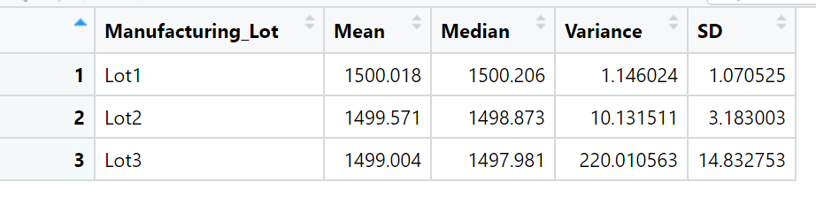
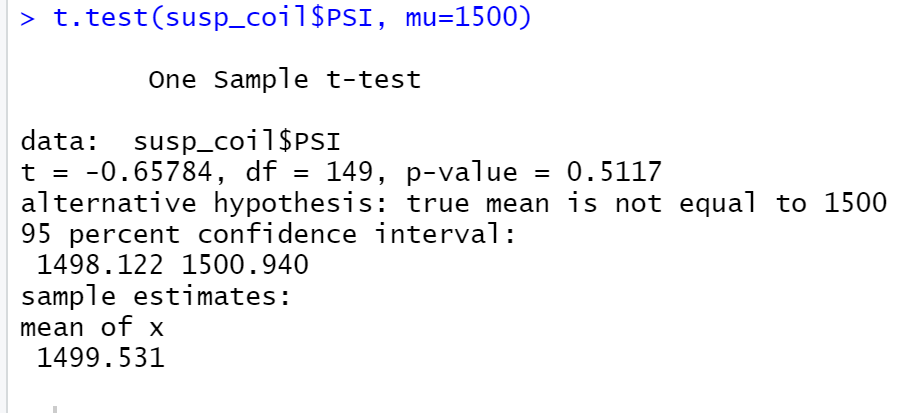

# MechaCar_Statistical_Analysis
## Linear Regression to Predict MPG

*From the summary, we can see that, vehicle weight and spoiler angle have nearly no impact on the mpg of the vehicle.
 *The p-value of this regression model is 5.35e-11 which is much smaller than our assumed significance level. Therefore, we can reject null hypothesis, state that the two means are statistically different. 
 *The slope are not zero for vehicle_length, AWD and ground_clearance.

## Summary Statistics on Suspension Coils

 In total, the current manufacturing data meets the design specification. However, the data of lot 3 alone does not. The variance of this lot is 220.01, which is higher than the requirements of 100.

## T-Tests on Suspension Coils

H0: there is no statistical difference
Ha: there is statistical difference
population mean: 1500 lbs per inch
