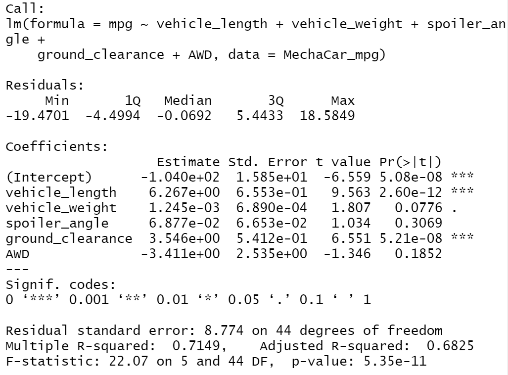

# MechaCar_Statistical_Analysis
## Linear Regression to Predict MPG

*From the summary, we can see that, vehicle weight and spoiler angle have nearly no impact on the mpg of the vehicle.
 *The p-value of this regression model is 5.35e-11 which is much smaller than our assumed significance level. Therefore, we can reject null hypothesis, state that the two means are statistically different. 
 *The slope are not zero for vehicle_length, AWD and ground_clearance.
